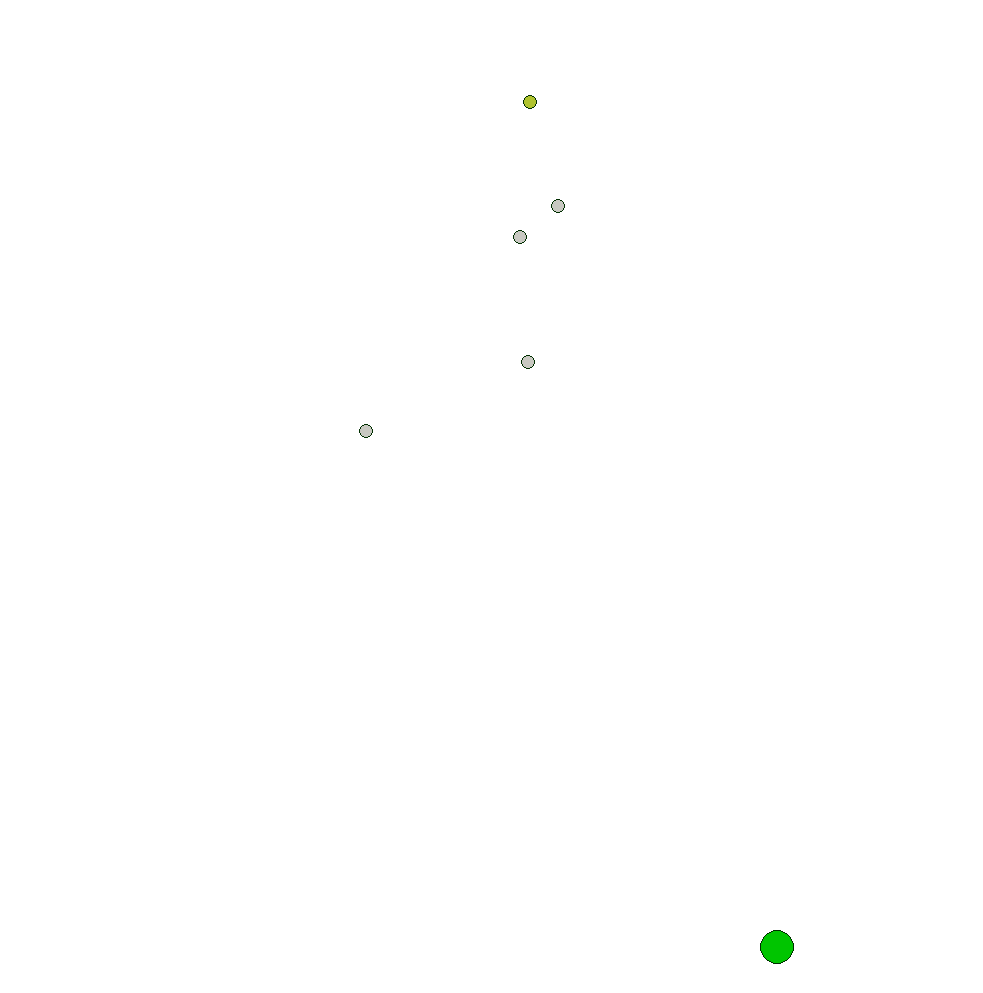

[](https://opensource.org/licenses/MIT)


A search and rescue implementation in pettingZoo.



## Installation

```
git clone https://github.com/NotEnoughSnow/MultiAgents_SAR.git
cd MultiAgents_SAR
pip install -r requirements.txt
```

## Running 

You can run the project with the following <br>
`python main.py`

You will need to change internal parameters in the main function manually

Modes:

- train

Trains and saves the model.
You can use 3 different algorithms from stable-baselines3: LSTM, PPO, DQN

- train_curr

An experimental method to train the model in curriculum learning.
Not useful yet.

- eval

Evaluates the trained and saved model on a number of games. you can set the number of games to evaluate on with the 'eval_games' const. 

- random

Runs pettingZoo with a random policy.
This is mainly as a placeHolder and for making sure everything runs well before training or evaluating.


## About the project

This project is part of a Masters in Artificial Intelligence course project during the fall semester of 2023 at ELTE university, Budapest.
The project Aims to study collective Intelligence behavior as part of a pettingZoo simulation.

### Environment

The SAR (search and rescue) environment used is a modification of the simple tag pettingZoo Env.
Types and properties of entities have been modified as well as their reward and observation functions. <br>

The second variation (V1) of environment (selected with 'version' in main) further modifies the environment on a simulation level to include radius vision
in order to limit information and make the environment more challenging.
(Under work)

### Training and evaluation

Both training and evaluation functions heavily use premade stable-baselines3 methods. You can find more about this at https://stable-baselines3.readthedocs.io

## Future development

- Migrate out of pettingZoo to facilitate development (Building a MARL env)
- Fully implement radius vision
- Implement agent communication
- Include a randomly generated structure for agents to navigate in
- Further study results