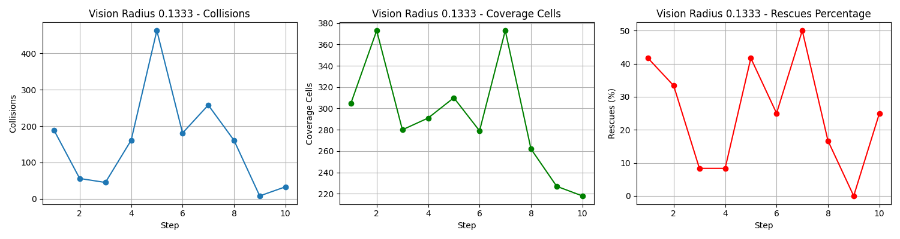
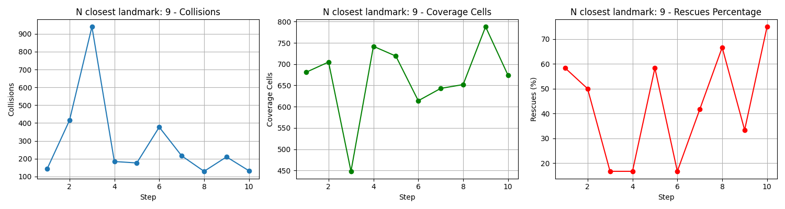
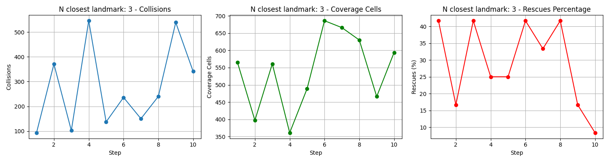

# Search & Rescue: Multi-Agent Reinforcement Learning

[](https://github.com/elte-collective-intelligence/student-search/actions/workflows/ci.yml)
[](https://github.com/elte-collective-intelligence/student-search/actions/workflows/docker.yml)
[](https://codecov.io/gh/elte-collective-intelligence/student-search)
[](LICENSE)
[](https://github.com/psf/black)

> A multi-agent cooperative search-and-rescue simulation using **MAPPO** (Multi-Agent PPO) with **Centralized Training, Decentralized Execution (CTDE)**, built on TorchRL and PettingZoo.

---

## Table of Contents

- [Search \& Rescue: Multi-Agent Reinforcement Learning](#search--rescue-multi-agent-reinforcement-learning)
  - [Table of Contents](#table-of-contents)
  - [Abstract](#abstract)
  - [Quick Start](#quick-start)
    - [Docker (Recommended)](#docker-recommended)
    - [Local Installation](#local-installation)
  - [Technical Deep Dive](#technical-deep-dive)
    - [CTDE Architecture](#ctde-architecture)
    - [Curriculum Learning](#curriculum-learning)
    - [Reward System](#reward-system)
      - [Positive Rewards](#positive-rewards)
      - [Penalties](#penalties)
      - [Energy Costs (when enabled)](#energy-costs-when-enabled)
    - [Observation Space](#observation-space)
    - [Action Space](#action-space)
    - [Energy System](#energy-system)
  - [Experiment Matrix \& Ablations](#experiment-matrix--ablations)
    - [Continuous vs. Discrete Control](#continuous-vs-discrete-control)
    - [Curriculum vs. No Curriculum](#curriculum-vs-no-curriculum)
    - [Failure Modes](#failure-modes)
  - [Metrics](#metrics)
  - [Project Structure](#project-structure)
  - [Configuration](#configuration)
  - [Team](#team)
  - [Documentation](#documentation)
  - [License](#license)
  - [References](#references)

---

## Abstract

This project implements a **multi-agent search-and-rescue environment** where cooperative rescuer agents must locate victims and escort them to type-matching safe zones while navigating around occluding obstacles. The environment features partial observability through vision-based occlusion, energy management with recharging stations, and a commitment-based victim following system.

We employ **MAPPO** with the **CTDE paradigm**—decentralized actors for scalable execution and a centralized critic for effective credit assignment. Training is accelerated through **curriculum learning**, progressively increasing obstacle density of trees.

---

## Quick Start

### Docker (Recommended)

```bash
# Build the image
make build
# or: docker build -t student-search:latest -f docker/Dockerfile .

# Train agents
make train
# or: docker run --rm -v "${PWD}/search_rescue_logs:/app/search_rescue_logs" student-search:latest

# Evaluate trained policy
make eval
# or: docker run --rm -v "${PWD}/search_rescue_logs:/app/search_rescue_logs" student-search:latest eval.active=true

# Launch TensorBoard (port 6006)
docker run --rm -p 6006:6006 -v "${PWD}/search_rescue_logs:/app/search_rescue_logs" student-search:latest tensorboard.active=true
```

### Local Installation

```bash
# Clone and setup
git clone https://github.com/elte-collective-intelligence/student-search.git
cd student-search

# Create virtual environment (Python 3.13+)
python -m venv .venv
source .venv/bin/activate  # Windows: .venv\Scripts\activate

# Install dependencies
pip install --upgrade pip
pip install -e ".[dev]"

# Training
python -m src.main train.active=true

# Evaluation with rendering
python -m src.main eval.active=true eval.render_mode=human

# TensorBoard monitoring
python -m src.main tensorboard.active=true
```

---

## Technical Deep Dive

### CTDE Architecture

We implement **Centralized Training, Decentralized Execution (CTDE)** using MAPPO:

| Component          | Architecture                 | Scope                                        |
| ------------------ | ---------------------------- | -------------------------------------------- |
| **Actor (Policy)** | 2-layer MLP, 64 units, Tanh  | Decentralized — uses only local observations |
| **Critic (Value)** | 2-layer MLP, 128 units, Tanh | Centralized — observes all agent states      |

**Key Design Choices:**

- **Parameter Sharing**: Homogeneous agents share network weights, reducing sample complexity
- **PPO Clipping**: `ε = 0.2` prevents destructive policy updates
- **GAE**: `γ = 0.99`, `λ = 0.95` for variance-reduced advantage estimation
- **Entropy Bonus**: Coefficient `0.001` encourages exploration

The actor outputs parameters for a `TanhNormal` distribution (continuous) or `Categorical` logits (discrete), enabling both action space configurations.

### Curriculum Learning

Training begins with an obstacle-free environment and progressively increases difficulty:

| Stage | Trees | Difficulty                               |
| ----- | ----- | ---------------------------------------- |
| 0     | 0     | Trivial — agents learn basic navigation  |
| 1     | 2     | Easy — sparse occlusion                  |
| 2     | 4     | Medium — moderate path planning required |
| 3     | 6     | Hard — significant occlusion             |
| 4     | 8     | Full — dense obstacle field              |

**Implementation Details:**

- Stages advance automatically based on training iteration count
- Observation space dimension remains fixed (`max_trees = 8`) to maintain network compatibility
- Unused tree slots are zero-padded in observations

**Progression Formula:**

```
trees(stage) = min_trees + floor(stage / (num_stages - 1) × (max_trees - min_trees))
```

### Reward System

The reward structure combines sparse success signals with dense shaping:

#### Positive Rewards

| Event                 | Reward                     | Recipient                                       |
| --------------------- | -------------------------- | ----------------------------------------------- |
| **Successful rescue** | `+100.0`                   | Assigned rescuer (victim reaches matching zone) |
| **Escort proximity**  | `+1.0 × exp(-d / 0.5)`     | Assigned rescuer (bounded shaping)              |
| **Escort delta**      | `+0.5 × (d_prev - d_curr)` | Assigned rescuer (progress toward zone)         |
| **Pickup delta**      | `+0.2 × (d_prev - d_curr)` | Unassigned rescuers (approaching victims)       |

#### Penalties

| Event                  | Penalty    | Recipient                                        |
| ---------------------- | ---------- | ------------------------------------------------ |
| **Tree collision**     | `-1.0`     | Colliding rescuer                                |
| **Agent collision**    | `-1.0`     | Both colliding rescuers (dist < 0.15)            |
| **Boundary violation** | `-0.2`     | Rescuer near edge (\|x\| > 0.95 or \|y\| > 0.95) |
| **Idling**             | `-0.01`    | Rescuer with velocity < 1e-3 (per step)          |
| **Pickup distance**    | `-0.1 × d` | Unassigned rescuers (encourages approach)        |

#### Energy Costs (when enabled)

| Event        | Cost                             |        |            |
| ------------ | -------------------------------- | ------ | ---------- |
| **Movement** | `0.01 ×                          | action | ` per step |
| **Idle**     | `0.001` per step                 |        |            |
| **Depleted** | Action scaled to 0 (cannot move) |        |            |

### Observation Space

Each agent receives a **local observation vector** with partial observability:

| Component           | Dimensions               | Description                                          |
| ------------------- | ------------------------ | ---------------------------------------------------- |
| Self velocity       | 2                        | `[vx, vy]`                                           |
| Self position       | 2                        | `[x, y]` in `[-1, 1]`                                |
| Agent ID            | `num_rescuers`           | One-hot encoding for symmetry breaking               |
| Energy              | 1                        | Normalized `[0, 1]` (if enabled)                     |
| N closest landmarks | `N × 5`                  | `[rel_x, rel_y, visible, is_safezone, type]`         |
| Victims             | `num_victims × 4`        | `[rel_x, rel_y, type, visible]` (masked if occluded) |
| Other rescuers      | `(num_rescuers - 1) × 3` | `[rel_x, rel_y, visible]` (masked if occluded)       |

**Default Configuration (6 rescuers, 12 victims, 9 landmarks, N=5 closes landmarks):**

```
obs_dim = 2 + 2 + 6 + 1 + (9 × 5) + (12 × 4) + (5 × 3) = 119
```

**Visibility Masking:**

- Entities beyond `vision_radius` (default: 0.4) are masked with zeros
- Line-of-sight occlusion uses **ray-circle intersection** against tree obstacles
- Saved victims are masked to indicate completion

### Action Space

| Mode                     | Space         | Description                   |
| ------------------------ | ------------- | ----------------------------- |
| **Continuous** (default) | `Box[-1, 1]²` | 2D acceleration vector        |
| **Discrete**             | `Discrete(5)` | {noop, up, down, left, right} |

**Physics Model:**

```
v_{t+1} = 0.8 × v_t + 0.1 × a_t
v_{t+1} = clip(v_{t+1}, max_speed=0.08)
x_{t+1} = x_t + v_{t+1}
```

### Energy System

Agents operate under energy constraints requiring strategic resource management:

| Parameter             | Default | Description                        |
| --------------------- | ------- | ---------------------------------- |
| `max_energy`          | 1.0     | Full energy capacity               |
| `movement_cost_coeff` | 0.01    | Cost scales with action magnitude  |
| `idle_cost`           | 0.001   | Base cost per step                 |
| `num_chargers`        | 2       | Recharging stations in environment |
| `recharge_radius`     | 0.12    | Distance to activate recharging    |
| `recharge_rate`       | 0.05    | Energy restored per step           |

When energy reaches zero, agents cannot move (`energy_depleted_action_scale = 0.0`), forcing them to plan routes through charging stations.

---

## Experiment Matrix & Ablations

### Continuous vs. Discrete Control

| Metric                   | Continuous | Discrete |
| ------------------------ | ---------- | -------- |
| **Rescue %**             | Higher     | Lower    |
| **Sample Efficiency**    | Moderate   | Higher   |
| **Fine-grained Control** | ✓          | ✗        |
| **Action Space Size**    | Infinite   | 5        |

**Finding:** Continuous control enables smoother trajectories and more precise victim escort, leading to higher rescue rates in dense environments.

### Curriculum vs. No Curriculum

| Configuration          | Dense Map (8 trees) Performance              |
| ---------------------- | -------------------------------------------- |
| **With Curriculum**    | Agents successfully navigate and rescue      |
| **Without Curriculum** | Agents fail to solve — stuck in local optima |

**Failure Analysis (No Curriculum):**

- Agents trained directly on 8-tree environments encounter sparse reward signals
- Initial random policies rarely achieve rescues, providing no learning signal
- Policy collapses to boundary-hugging or static behavior

**Curriculum Benefit:**

- Early stages (0-2 trees) provide dense reward signal for basic navigation
- Progressive difficulty allows transfer of learned behaviors
- Final stage performance matches or exceeds single-stage training on easy environments

### Ablation Studies

We conducted ablation studies to analyze the impact of key hyperparameters on agent performance. All experiments used `total_timesteps=1024000` and `seed=13` with base configuration from `config.yaml`.

**Tracked Metrics:**

- **Rescues (%)** — Percentage of victims successfully delivered to matching zones
- **Collision Count** — Total tree + agent collisions per episode
- **Coverage (cells)** — Unique grid cells visited (exploration metric)

#### Vision Radius Ablation

Comparing wide vs. narrow field of view:

```bash
# Wide vision
python -m src.main train.active=true env.vision_radius=0.5

# Narrow vision (restricted)
python -m src.main train.active=true env.vision_radius=0.1333
```

| Metric          | vision_radius=0.5 | vision_radius=0.1333 |
| --------------- | ----------------- | -------------------- |
| **Rescues (%)** | ~17% (avg)        | ~25% (avg)           |
| **Collisions**  | ~210 (avg)        | ~140 (avg)           |
| **Coverage**    | ~340 (avg)        | ~290 (avg)           |




**Analysis:** Counter-intuitively, the narrower vision radius (0.1333) achieved slightly higher rescue rates while maintaining lower collision counts. This suggests that restricted vision may encourage more cautious, deliberate navigation behavior. However, the wider vision radius (0.5) resulted in better coverage, as agents could detect and respond to more of the environment. The trade-off indicates that vision radius should be tuned based on whether exploration or safe navigation is prioritized.

#### N Closest Landmarks Ablation

Comparing rich vs. sparse landmark observations:

```bash
# Rich landmark info
python -m src.main train.active=true env.n_closest_landmarks=9

# Sparse landmark info
python -m src.main train.active=true env.n_closest_landmarks=3
```

| Metric          | n_closest_landmarks=9 | n_closest_landmarks=3 |
| --------------- | --------------------- | --------------------- |
| **Rescues (%)** | ~45% (avg)            | ~25% (avg)            |
| **Collisions**  | ~300 (avg)            | ~280 (avg)            |
| **Coverage**    | ~650 (avg)            | ~530 (avg)            |




**Analysis:** Providing richer landmark information (N=9) significantly improved rescue performance (~45% vs ~25%), demonstrating that agents benefit from more complete environmental awareness. The higher collision count with N=9 is likely due to increased exploration behavior, as evidenced by the substantially higher coverage (~650 vs ~530 cells). Agents with sparse landmark observations (N=3) appear more conservative but less effective at completing the rescue task. This ablation confirms that landmark observation richness is a critical hyperparameter for task success.

### Failure Modes

1. **Hysteresis Loops (Victim Swapping)**

   - Two agents approach the same victim from opposite sides
   - Victim commitment oscillates between agents
   - **Mitigation:** Commitment hysteresis (`1.5×` release threshold, `0.6×` switch threshold)

2. **Sparse Reward Plateaus**

   - In high-tree environments, random policies rarely achieve rescues
   - No gradient signal for policy improvement
   - **Mitigation:** Dense shaping rewards (pickup/escort deltas)

3. **Energy Starvation**

   - Agents deplete energy far from chargers
   - Become immobile, unable to complete rescues
   - **Mitigation:** Energy cost as negative reward encourages efficient pathing

4. **Boundary Clustering**
   - Agents learn to minimize boundary penalties by staying near the center
   - Victims near edges are neglected
   - **Mitigation:** Balanced shaping rewards outweigh boundary penalties

---

## Metrics

Three primary metrics are tracked and logged to TensorBoard:

| Metric              | Description                                                    | Ideal Value |
| ------------------- | -------------------------------------------------------------- | ----------- |
| **Rescue %**        | Percentage of victims successfully delivered to matching zones | 100%        |
| **Collision Count** | Total tree + agent collisions per episode                      | 0           |
| **Coverage**        | Unique grid cells visited (exploration metric)                 | High        |

**Additional Energy Metrics (when enabled):**

- `mean_energy_pct`: Average remaining energy at episode end
- `recharge_events`: Number of successful recharges
- `energy_depleted_steps`: Steps where agents were immobilized

---

## Project Structure

```
.
├── src/
│   ├── main.py           # Hydra CLI entry point
│   ├── sar_env.py        # PettingZoo environment implementation
│   ├── models.py         # Actor-Critic network factories
│   ├── train.py          # MAPPO training loop
│   ├── eval.py           # Evaluation pipeline
│   ├── curriculum.py     # Curriculum scheduler
│   ├── logger.py         # TensorBoard logging utilities
│   └── seed_utils.py     # Reproducibility utilities
├── tests/
│   ├── conftest.py       # Pytest fixtures
│   ├── test_env_smoke.py # Environment smoke tests
│   └── test_vision.py    # Vision/occlusion tests
├── conf/
│   └── config.yaml       # Hydra configuration
├── docker/
│   └── Dockerfile        # Container definition
├── pyproject.toml        # Python project metadata
├── Makefile              # Build automation
└── Documentation.pdf     # Detailed technical documentation
```

---

## Configuration

Configuration is managed via [Hydra](https://hydra.cc/). Key parameters:

```yaml
env:
  victims: 12
  rescuers: 6
  trees: 8
  vision_radius: 0.4
  continuous_actions: true
  energy:
    enabled: true
    num_chargers: 2

curriculum:
  enabled: true
  min_trees: 0
  max_trees: 8
  num_stages: 5

train:
  total_timesteps: 102400
  batch_size: 256
  learning_rate: 0.0003
  n_epochs: 20
```

**Override via CLI:**

```bash
python -m src.main train.active=true env.rescuers=8 curriculum.enabled=false
```

---

## Team

This project was developed as part of the **ELTE Collective Intelligence Course (Assignment 2)**.

| Member                 | Contributions                                                                                                                                                                                             |
| ---------------------- |-----------------------------------------------------------------------------------------------------------------------------------------------------------------------------------------------------------|
| **Adorján Nagy-Mohos** | TorchRL migration, Curriculum learning, CTDE/MAPPO architecture, Hydra + Docker integration, Victim dynamics, Scenario generation, Vision system (occlusion logic fix), Continuous control implementation |
| **Máté Kovács**        | Infrastructure (TensorBoard logging), Testing suite, Documentation (LaTeX/Docstrings), README.md, Metrics analysis, Presentation                                                                          |
| **Sándor Baranyi**     | Vision system (N-closest landmark), Ablation studies, Energy budget features, Bounded Box observation space, Victim dynamics                                                                                |

_All team members contributed equally (~33% each)._

**Contact:**

- Adorján Nagy-Mohos — [d5vd5e@inf.elte.hu](mailto:d5vd5e@inf.elte.hu)
- Máté Kovács — [u5bky4@inf.elte.hu](mailto:u5bky4@inf.elte.hu)
- Sándor Baranyi — [ct9xfj@inf.elte.hu](mailto:ct9xfj@inf.elte.hu)

---

## Documentation

For comprehensive technical documentation including mathematical formulations, algorithm pseudocode, and implementation details, see:

📄 **[Documentation.pdf](Documentation.pdf)** — Full technical report with:

- Detailed environment dynamics and physics equations
- Complete reward function derivations
- MAPPO algorithm implementation specifics
- Observation/action space formal definitions
- Training hyperparameter analysis

---

## License

This project is licensed under the **MIT License** — see [LICENSE](LICENSE) for details.

---

## References

- [PettingZoo Documentation](https://pettingzoo.farama.org/)
- [TorchRL Documentation](https://pytorch.org/rl/)
- [Hydra Documentation](https://hydra.cc/)
